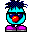

<p align="center">
  
</p>

<h1 align="center">Logical Journey of the Zoombinis: Decompilation</h1>

<p align="center">
  <a href="https://zoombinis.online"><strong>Play the game</strong></a>
  &nbsp;·&nbsp;
  <a href="https://docs.zoombinis.online"><strong>Read the handbook</strong></a>
</p>

A nostalgic game from my childhood, and my latest attempt at getting it decompiled and runnable from source on modern systems.

The target is the 1996 Windows release by Broderbund. The disc ships two builds of the game; this project targets the **32-bit Windows 95 build** (`zoombi32.exe`, a PE32 executable built with Borland C++ 4.5). Its assets are Mohawk archives, the container format of Myst and Living Books.

- **Play it:** the decompiled game runs in your browser as WebAssembly at **[zoombinis.online](https://zoombinis.online)**. It's a complete port, though not yet fully tested, so you may encounter bugs. It is an unofficial fan project, not affiliated with the game's creators or publishers.
- **Read about it:** the **[handbook](https://docs.zoombinis.online)** explains how everything works: the tools, the file formats, the decompiled code and engine, the port, and a walk through the game that links each screen and puzzle to the code behind it. Its source is in [`docs/`](docs/src/introduction.md).

## Status

Every function in `zoombi32.exe`'s game code and Mohawk engine (about 2,100) is decompiled to C++ in `decomp/`. 1,914 compile, with Borland C++ 4.5, to exactly the original bytes; 170 differ only slightly (mostly register choice); 44 are portable stand-ins for what the original did in machine code or with Borland-specific types. The Borland runtime and QuickTime's SDK glue are library code and aren't decompiled. Every function, global and module has a descriptive name.

The game's resources are in `assets/`, converted to modern formats (about 10,000 images as PNG, 1,333 sounds as WAV, the music as MIDI, scripts and tables as TOML, the intro movie as sprites and a WAV), and `uv run assets pack` rebuilds archives identical, byte for byte, to the disc's.

The decompiled code links, with the original's linker, into a `zoombi32.exe` that starts in an emulated Windows 98 and runs as far as Zoombini Isle, and compiles unchanged over *miniwin*, a Win32 subset on SDL2, for WebAssembly, macOS, Linux and Windows (32- and 64-bit). Every pull request is checked by [CI](https://docs.zoombinis.online/reference/ci.html): all targets build, a visual regression suite plays the headless port through scripted flows, and every function that matched still does.

## Quick start

Supported hosts: macOS on Apple Silicon (tested) and Linux (should work, untested). You need [uv](https://docs.astral.sh/uv/); the tools tell you if anything else is missing and how to install it.

**Without any game files** you can build and run the port, and use the assets:

```sh
uv run port setup browser_wasm    # the pinned Emscripten SDK (~1.8 GB) and the SoundFont
uv run port package browser_wasm  # the site: build/port/dist/browser_wasm/
uv run port serve                 # then open http://127.0.0.1:8000/
uv run port package               # a package for players, for this machine (a Mac: .dmg; Linux: .tar.gz)
uv run port package windows_x64   # or any target, from any host (see `uv run port --help`)
uv run assets pack                # assets/ back into Mohawk archives, in build/assets/
uv run visual                     # visual regression tests (needs `uv run port build headless_wasm`)
```

**To work on the decompilation** you need your own copies of the game and the compiler, put in the gitignored `data/` directory:

| File | What it is |
| --- | --- |
| `data/Logical Journey of the Zoombinis.iso` | the game CD, e.g. from [the Internet Archive](https://archive.org/details/logical-journey-of-the-zoombinis) |
| `data/Borland C++ 4.5.iso` | the compiler the game was built with |
| `data/Windows 98 Second Edition.iso` | for the emulated PC (and a `WINDOWS_PRODUCT_KEY` in a gitignored `.env`) |

```sh
uv run extract-game          # the disc and the Windows 95 build into build/
uv run toolchain setup       # Borland C++ under Wine
uv run match                 # compare every decompiled function with the original, byte for byte
uv run report --open         # progress report (contains disassembly: keep it local; --no-embed-binary leaves it out)
```

The handbook's [Prerequisites](docs/src/getting-started/prerequisites.md) and [Setup](docs/src/getting-started/setup.md) chapters cover everything else: Ghidra, the Windows 98 VM, the rebuild, cleaning up.

## Repository

| Path | Contents |
| --- | --- |
| `decomp/` | the decompiled game and engine, one `.cpp` per original object file |
| `assets/` | the game's resources in modern formats |
| `glue/`, `port/` | standing-in code for QuickTime's SDK; the port (CMake, SDL2, miniwin) |
| `src/zbtools/` | the Python tooling, each tool run as `uv run <name>` |
| `docs/` | the handbook (mdBook): `uv run book build` or `uv run book serve` |
| `tests/` | pytest, for everything checkable without the game files |

Development checks: `uv run lint` (ruff, strict mypy, pytest), also run as a pre-commit hook (`uv run pre-commit install`); it needs none of the game files, so port work needs no ISOs. Pull requests also run the checks that do (`uv run match`, `match-data`) in CI, with the files fetched from a private bucket, and main publishes the site, the releases and a progress report ([CI](docs/src/reference/ci.md)). See `CLAUDE.md` and the handbook for conventions.

## Roadmap

- [x] Extract the disc and the Windows 95 build (`uv run extract-game`)
- [x] Scripted Windows 98 VM (`uv run vm install` / `run` / `reset`)
- [x] Scripted QuickTime and game install in the VM (`uv run vm install-game`); game reaches its title screen
- [x] Game verified playable in the VM, from its disc image
- [x] Mohawk archive extractor and packer, reproducing the disc's archives exactly (`uv run assets`)
- [x] Convert the resources to modern formats (sounds, images, scripts, palettes, MIDI) and back, exactly
- [x] Borland C++ 4.5 and 4.52 toolchains running under Wine (`uv run toolchain`)
- [x] Function matcher (`uv run match`) and the first matching functions
- [x] Ghidra project with auto-analysis, function list and decompiler (`uv run ghidra`)
- [x] Label the Borland runtime functions in Ghidra (`uv run runtime-symbols`, `uv run ghidra label`)
- [x] Switch `decomp/` to C++; demangle Borland names
- [x] Harvest class names (RTTI) and vtables; teach Ghidra the calling conventions
- [x] Settle the compiler: Borland C++ 4.5 (4.52 is identical) with default options
- [x] Decompile the game and the engine, function by function (every function written)
- [ ] Byte-match the remaining near-misses, where practical
- [x] Define the game's globals with their initial values, and check them, and the code's references to them, against the original (`uv run define-data`, `uv run match-data`)
- [x] Link the decompiled code and its resources (the icon) with TLINK32 into a `zoombi32.exe` that runs in the VM (`uv run build`, `uv run vm run --exe`)
- [ ] Play the rebuilt game through in the VM, fixing what differs from the original
- [x] Reverse-engineer Broderbund's `QkBk` video codec, and convert the movies to a modern format and back, exactly (`uv run assets`, `uv run movie-check`)
- [x] Replace the QuickTime stand-in with working glue, so the rebuilt game plays its intro movie in the VM
- [x] Play the intro movie in the port, from its modern format (`port/glue/quicktime.cpp`)
- [x] Port to WebAssembly: SDL2 and a Win32 subset (*miniwin*) running the decompiled game in a browser, with the intro movie, sound and music (`uv run port`)
- [x] Port to macOS (native): runs through the game
- [x] Port to Linux (native): built in a container, run through every scene
- [ ] Port to Windows (native): cross-compiled for 32- and 64-bit; the 64-bit build has been run only under Wine, the 32-bit one not at all
- [ ] Play the port through every puzzle, fixing what differs from the original
- [x] Make the decompiled code 64-bit clean (pointer-sized handles are `LONG_PTR`), so the port builds natively on 64-bit hosts
- [x] Debug tools for the port (jump to a scene, set levels, script clicks) and visual regression tests built on them (`uv run visual`)
- [x] CI: every target builds and is released from `main`; `match` and `match-data` run on pull requests, and a progress report without the original's disassembly is published, with the game's files fetched from a private bucket (`--no-embed-binary`)
- [x] The port raises a group's level after three perfect clears, as players expect (the original does it after one)

## Legal and credits

This repository does not distribute the original game's binaries or its disc. It holds source reconstructed from them, the decompiled code and the game's resources converted to modern formats, from which the tools rebuild the original archives. It exists for preservation and interoperability. Building anything needs your own copy of the game; the port it builds is made to be hosted and played in a browser. *Zoombinis* and all related names and artwork belong to their respective owners.

The port uses [SDL2](https://libsdl.org), [stb_truetype](https://github.com/nothings/stb), [TinySoundFont](https://github.com/schellingb/TinySoundFont) and the [GeneralUser GS](https://www.schristiancollins.com/generaluser.php) SoundFont by S. Christian Collins (free to use and redistribute in software). The game's font, Cornerstone, is free for personal use and is included on that basis since this project is non-commercial; if you plan to use the project commercially, replace it.
