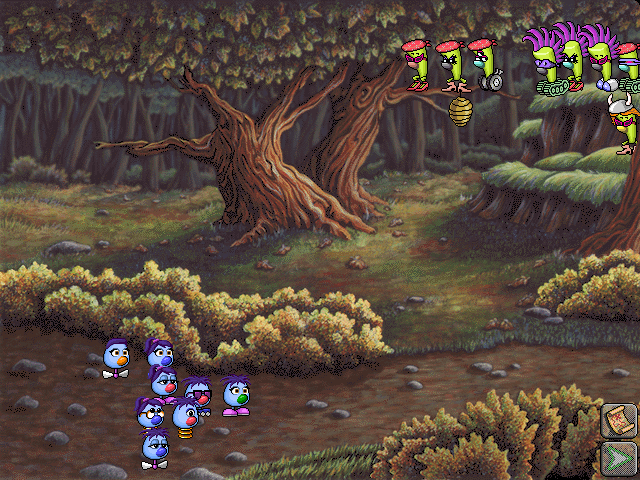
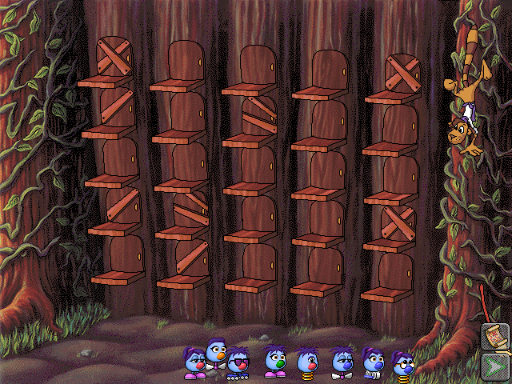
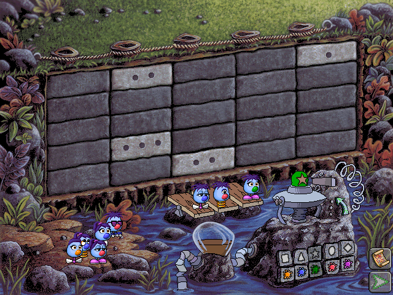

# Group 3: fleens, hotel and wall

Chosen at Shelter Rock (button 2 → scene 13). Chained: Fleens! → Hotel Dimensia → Mudball Wall → Shade Tree.

## Fleens (scene 13)

> 📷 **Screenshot: `fleens-overview`**
> *The Fleens scene: a row of Fleens (small creatures) beside a line of Zoombinis.*
> *Capture:* from Shelter Rock, set out with button 2.

> 📷 **Screenshot: `fleens-pick`**
> *A Zoombini dragged beside a fleen; the pair walking on together.*
> *Capture:* drag a Zoombini to a fleen.

| | |
| --- | --- |
| Scene / module / archive | 13 / `decomp/fleens.cpp` / `FLEENS` (`Fleens.MHK`) |
| Group list | `fleensGroups` → `fleensClicked` |
| Level | `fleensLevel` (new rules on a new game at levels 1 and 3) |

| Function | Address | Role |
| --- | --- | --- |
| `openFleens` | `0x421738` | opens `Fleens.MHK`, sounds, images and scripts, the views and the party |
| `fleensFrame` | `0x421d1e` | counts Zoombinis walking up to their fleen (`lineSnoids`, `lineFleens`, `pickedFleensFound`); every so often (`fleensFidgetInterval`) sends a waiting Zoombini on, up to `fleensFidgetsAllowed`; moves the line on (`moveFleenZoombinisOn`); at the end goes to scene 14 |
| `fleensClicked` | `0x422192` | 1 leaves (asking to keep the party); 2 sends the Zoombinis on (once `fleensGoReady` and `fleensEntered`), counted in `snoidsOnTheirWay`; 3 (while nothing is moving) drags a Zoombini: a placed one freely, another only when its fleen is idle; with practice mode a click on a fleen makes its Zoombini jump |
| `addFleens` | `0x422e90` | makes the fleens, one for each traveller, with their features changed by the level's rules; picks up to three to stand apart (`pickedFleens`, placed by table 5000), the others by table 5001 |
| `layOutFleen` | `0x422747` | lays out a fleen's cels for its script's frames |
| `fleensLeaderNotify`, `fleensExtraNotify` | `0x42365a` | the leader fleen's script events: turn, move views into order, send the picked fleens on or back, move the line, add a random extra |
| `fleensWalkerNotifyA/C/E`, `fleensMovingOnNotify` | | the walking Zoombinis |

**Things to know**: a Fleen is drawn like a Zoombini (a `Snoid`, laid out by the fleens' own `layOutSnoid` over fleen images and hot spots); its scripts are separate (`loadFleenScripts`).

## Hotel Dimensia (scene 14)

> 📷 **Screenshot: `hotel-overview`**
> *The hotel at a higher level: five columns of rooms with their ledges and some doors crossed out, a figure climbing the vine at right, and the Zoombinis arriving along the bottom.*
> *Capture:* complete the Fleens.

> 📷 **Screenshot: `hotel-rooms`**
> *Zoombinis sent into rooms; a room that doesn't fit stays dark.*
> *Capture:* send a Zoombini to a room.

| | |
| --- | --- |
| Scene / module / archive | 14 / `decomp/hotel.cpp` / `HOTEL` (`Hotel.MHK`) |
| Group list | `hotelGroups` → `hotelClicked` |
| Level | `hotelLevel` |

| Function | Address | Role |
| --- | --- | --- |
| `openHotel` | `0x424274` | opens `Hotel.MHK` at the level reached |
| `hotelFrame` | `0x424b2d` | per-frame; leaving goes to scene 15 |
| `hotelClicked` | `0x426230` | buttons and clicking a room |
| `setUpHotelPuzzle` | `0x425dde` | picks which features the rows, columns (and layers) sort by, so that the chosen Zoombinis fit; at level 2 places some pieces at random in squares no Zoombini can take |
| `fitsRoom`, `fitsRoom3d` | `0x426aff`, `0x427217` | whether a Zoombini fits a room (2D, and the 3D levels' layers) |
| `sendSnoidToRoom` | `0x42790a` | works out where it stands and the area it covers, and starts its script (by level, square and feet) |
| `hotelSnoidNotify`, `roomViewNotify` | `0x4276d0`, `0x427e1a` | script events |
| `drawFeatureLabels`, `drawIdBox`, `layOutRoomView` | | the labels and room art |
| `darkenPalette` | | the lights going out |

## Mudball Wall (scene 15)

> 📷 **Screenshot: `mudball-overview`**
> *The wall of 5×5 stones with a rope along its top and the pond below; a Zoombini on the rocks.*
> *Capture:* complete the hotel.

> 📷 **Screenshot: `mudball-codes`**
> *The codes box showing the chosen row and column values.*
> *Capture:* click the controls to set a code.

| | |
| --- | --- |
| Scene / module / archive | 15 / `decomp/net.cpp` / `NET` (`Net.MHK`) |
| Group list | `netGroupList` → `netClicked` (18 items in `netButtons`) |
| Level | `netLevel` (0-3): levels 0-1 use 5×5 codes (columns and rows), 2-3 add a third dimension (5×5×5, `markerPlaces3d[125]`) |

| Function | Address | Role |
| --- | --- | --- |
| `openNet` | `0x43b20c` | picks three random codes, loads the backdrop (by level), features, scripts and images, brings the party in, sets up the codes and the net, shows the hint |
| `netFrame` | `0x43b86d` | per-frame; on completion sends the party to Shade Tree (`sceneDue = 5`), sets bit `<<4` in `gameState+0x52` |
| `netClicked` | `0x43c48b` | clicks on the controls |
| `setUpCodes` | `0x43c9e2` | picks for each of five rows a column value and a row value (and from level 2 a third) that no row has yet, fills `codeColumns` and `codeRows` (5×5) or also `codeLayers` (5×5×5), at levels 1 and 3 rotates rows by 2-3 places, places the party's Zoombinis (`netGroups`) at random free entries, picks the order of the codes |
| `chooseCode` | `0x43d0b4` | a code chosen: sets the first, second or third code to a value and shows it; once all the codes the level needs are set, shows the marker and the net's view; `0` sends the marker off |
| `markerPlaced`, `flyMarker`, `landMarker`, `updateFlyingMarker` | `0x43d70d`, `0x43e435`, `0x43da30` | the marker flying to its entry in the wall and landing |
| `crossingNotify` | `0x43de4d` | the Zoombini's script events as it crosses |
| `splitIntoGroups`, `sendNextToNet`, `stepMazeSnoid` | `0x43e370`, `0x43cfc3`, `0x43a2c8` | the party's walk to the net |

**Things to know**

- **`net.cpp` is a big module with several roles:** besides this puzzle it holds `enterNextScene` (the scene switch), the per-scene remark pools (`bridgeSounds`, … `smokeSounds`), and walking helpers whose names mention the maze (`layOutMazeCels`, `stepMazeSnoid`, `mazeZoombinisMeet`).
- `splitIntoGroups` can write more of `netGroups` than the 12 it clears, over `currentNetPlace` and what follows: a genuine overrun in the original (see [Data layout](../concepts/data-layout.md)).
