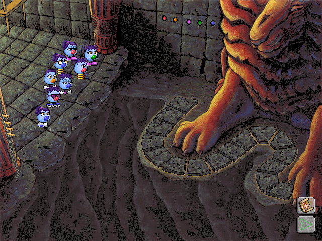
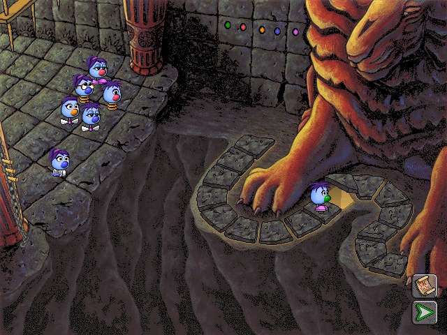
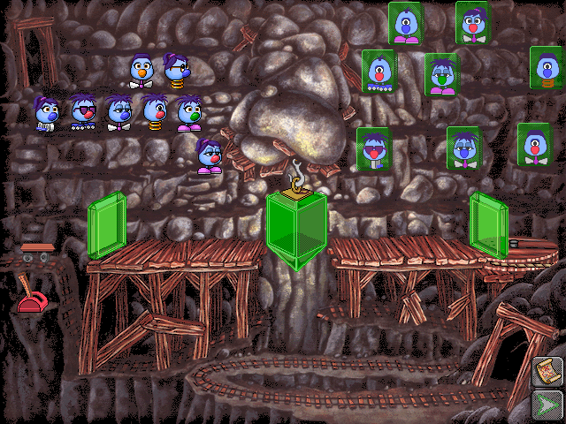
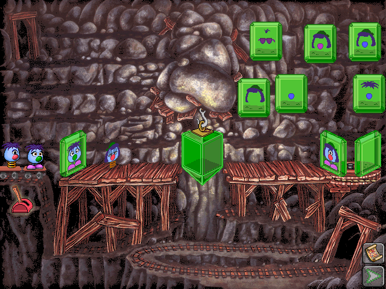
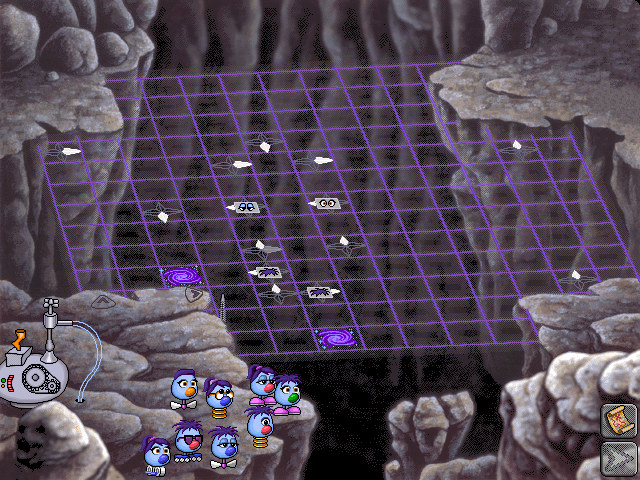
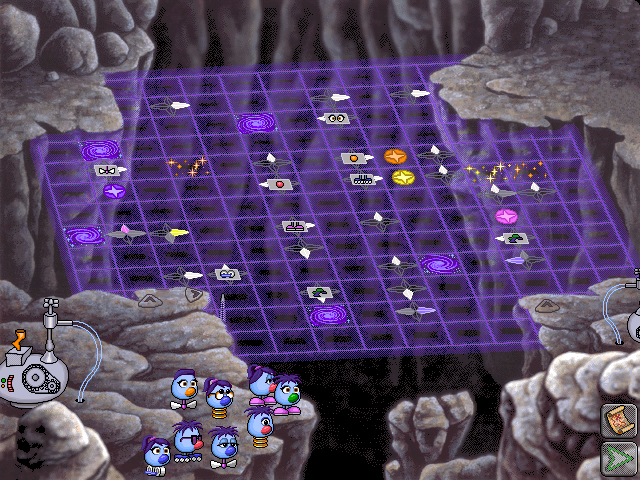

# Group 4: the last three puzzles

Reached from Shade Tree (`camp2Clicked` button 1 → scene 16). Chained: The Lion's Lair → Mirror Machine → Bubblewonder Abyss → Zoombiniville.

## The Lion's Lair (scene 16)

> 📷 **Screenshot: `lion-overview`**
> *The lair: the lion's paw over the golden stepping stones across the chasm, with Zoombinis at the left.*
> *Capture:* from Shade Tree, set out.

> 📷 **Screenshot: `lion-places`**
> *A Zoombini on a stone of the path across the chasm, with the lion's paw above and the others waiting at left.*
> *Capture:* drag Zoombinis onto the stones.

| | |
| --- | --- |
| Scene / module / archive | 16 / `decomp/roster.cpp` / `CAVES` (`Caves.MHK`) |
| Group list | `caveGroups` → `cavesClicked` |
| Level | `cavesLevel` |

The module is named for its strings, since it also holds the [saved-game code](../codebase/game-state.md); `Caves.MHK` is the lion's lair.

| Function | Address | Role |
| --- | --- | --- |
| `openCaves` | `0x41c09c` | loads the state, scripts and sounds, the views for 20 places (the party's, and the cave's rows), the roster's resources and a line by the level |
| `cavesFrame` | `0x41ca44` | per-frame; leaving goes to scene 17 |
| `cavesClicked` | `0x41d3f4` | buttons; dragging; a click on a feature glyph (`changeCaveFeature`) |
| `setUpCaves` | `0x41e0e3` | picks the roster's features and lays out the places for them |
| `layOutCaves`, `pickCaveFeatures`, `countByCaveFeatures` | `0x41e5e1`, `0x41e273` | which places want which values |
| `pickCave` | `0x41e771` | the place for the Zoombini of a view: *n* if it's free and wants the Zoombini's values of the roster's features, else a free one that does, at random; 1 if none |
| `changeCaveFeature` | `0x41e920` | changes the roster's first feature (the second moves on if they'd be the same), lays the places out again and walks the Zoombinis that had places to their new ones |
| `sendToCaves`, `walkToSpots`, `walkNext` | `0x41eb43`, `0x41ec69` | walking Zoombinis to places |
| `drawGlyph`, `drawGlyphs`, `drawFeatureTable`, `placeGlyphs` | | the feature glyphs and the table |

## Mirror Machine (scene 17)

> 📷 **Screenshot: `mirror-overview`**
> *The mine: a boulder wedged overhead, wooden trestles and a rail track, with two rows of Zoombinis facing each other.*
> *Capture:* complete the Lion's Lair.

> 📷 **Screenshot: `mirror-grid`**
> *The Mirror Machine at its highest level: the green panels, each showing the features it asks for, over the trestles, and Zoombinis waiting at left.*
> *Capture:* at higher levels.

| | |
| --- | --- |
| Scene / module / archive | 17 / `decomp/game.cpp` (with `WinMain`) / `SMOKE` (`Smoke.MHK`) |
| Group list | `smokeGroups` → `smokeClicked` |
| Level | `smokeLevel` (1-4): levels 1-2 take the features of one Zoombini picked at random, levels 3-4 two of the party |

| Function | Address | Role |
| --- | --- | --- |
| `openSmoke` | `0x44e494` | resets state, picks the level and scripts, opens `Smoke.MHK`, adds views and the Zoombinis', takes the features of the Zoombini (or two) that the puzzle is built from, sets the last two of the party walking in, starts the opening scripts |
| `smokeFrame` | `0x44f25d` | per-frame; leaving goes to scene 18 |
| `smokeClicked` | `0x44fa57` | buttons; drags to cells and the "deal" button |
| `startRound` | `0x4507e0` | empties the slot views and deals new Zoombinis for the level |
| `dealFeatures`, `dealRandomFeatures`, `giveSlotFeatures` | `0x45222d`, `0x452258` | deals features to four Zoombinis |
| `recordSlotFeatures`, `applySlotFeatures` | `0x4513ac` | the left and right feature slots |
| `startNextCrossing`, `startNextMove` | `0x45162e`, `0x4514f6` | the crossing and the movers' scripts |
| `startGrid`, `growGrid`, `settleCells`, `fillFreeCells` | `0x44cc51`, `0x44ce56`, `0x44d127`, `0x44d5f5` | the hex grid at higher levels: puts the first Zoombini on it (the next one alike), then grows it |
| `shareFeature`, `placeAlike`, `markSharedFeature` | `0x44cd71`, `0x44d3b8` | whether two Zoombinis share a feature, and placing the alike ones side by side |
| `dragSnoidToSpot` | `0x453e8c` | dragging a Zoombini to a cell |

**Things to know**: several views are named after their ids (`view11036`, `view11019`…) because their purpose isn't known yet; the dealer button's lit/pressed/dim states are `lightDealButton`, `pressDealButton`, `dimDealButton`.

## Bubblewonder Abyss (scene 18)

> 📷 **Screenshot: `bubble-overview`**
> *The chasm with the purple grid laid over it, its arrows and symbols, and the Zoombinis waiting at lower left.*
> *Capture:* complete the Mirror Machine.

> 📷 **Screenshot: `bubble-lines`**
> *The grid at a higher level: more squares carry arrows, swirls and symbols.*
> *Capture:* at higher levels.

| | |
| --- | --- |
| Scene / module / archive | 18 / `decomp/maze.cpp` / `MAZE2` (`Maze2.MHK`) |
| Group list | `mazeGroups` → `mazeButtonClicked` |
| Level | `mazeLevel` (0-4; level 3 with fewer than five Zoombinis plays as 4) |

| Function | Address | Role |
| --- | --- | --- |
| `openMaze` | `0x433510` | resets state, loads images, scripts and tables, picks the level and layout (`loadHotSpotTable`), adds the views of the layout's pieces and lines, sets the puzzle up, brings the Zoombinis in |
| `mazeFrame` | `0x43490e` | per-frame; the last puzzle sends the party to **Zoombiniville** (`sceneDue = 6`) and sets bits in `gameState+0x51` |
| `mazeButtonClicked` | `0x435264` | buttons and dragging |
| `setUpMaze` | `0x436abf` | sets the maze up for a level: the squares' kinds, the lines' values shuffled, a sequence of values by one of five ways for the level, and the Zoombinis' views |
| `chooseSequence1`-`5` | `0x438396`…`0x439190` | the five ways of choosing the sequence from the chosen Zoombinis' features |
| `takeRarestValue`, `takeCommonestValue`, `takeRareRow` | `0x43780d`, `0x437b7b` | picks the value with the fewest/most counts |
| `addMazeSnoids`, `moveSnoidToSquare`, `mazeSnoidNotify` | `0x436c71`, `0x43596d`, `0x43638b` | the Zoombinis in the maze |
| `countValuesPresent`, `valueCount`, `indexOfLargestExcept` | `0x437390` | counting the party's values |

**Things to know**: this is the last puzzle; finishing it records a completed journey in the roster (`recordParty`, the town's monuments).
