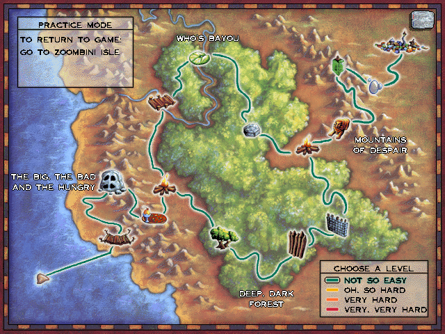

# Gameplay and the code

This part walks through the game **in the order a player meets it**, and for every screen says: what scene it is, which module and archive it comes from, which functions open it, run it and respond to clicks, which globals hold its state, and where its rules live. Use it to go from "I'm looking at this" to the code, or the reverse.

## The journey in one picture

```text
 start ─▶ intro logo movie (0) ─▶ Zoombini Isle (3): make the Zoombinis ─▶ Allergic Cliffs (7)
                                                                              │ group 1
                                                    Stone Cold Caves (8) ◀────┘
                                                              ▼
                                                    Pizza Pass (9) ─▶ Shelter Rock (4)   camp
                                     ┌──────────────── set out ────────────────┐
                           button 1  ▼                                          ▼  button 2
        group 2: Captain Cajun's Ferryboat (10)                  group 3: Fleens! (13)
                 Titanic Tattooed Toads (11)                              Hotel Dimensia (14)
                 Stone Rise (12) ──────┐                                  Mudball Wall (15) ──┐
                                       ▼                                                     ▼
                                  Shade Tree (5)   camp, the second   ◀──────────────────────┘
                                       │ set out
                                       ▼
        group 4: The Lion's Lair (16) ─▶ Mirror Machine (17) ─▶ Bubblewonder Abyss (18) ─▶ Zoombiniville (6)

 Between most scenes the journey scene (2) shows the party travelling on the map; the map (1) is
 reachable from anywhere; a puzzle's "back" button returns to it.
```

Within a group each puzzle's frame sets `sceneDue` to the next one when the last Zoombini is through (`openBridge` → … `sceneDue = 8`, 9, 4; `sceneDue = 11`, 12, 5; …). Shelter Rock's two "set out" buttons start group 2 (scene 10) or group 3 (scene 13); either finished group opens Shade Tree, whose button leads to group 4 (scene 16). The *practice mode* of the map (Ctrl-P) lets the player visit any puzzle at a chosen level without touching the saved journey. Progress is kept in `gameState` (`puzzleLeft`, `+0x50`-`0x52`, `sceneFlags()`).

## The skeleton every puzzle shares

All twelve puzzle scenes were written to one template, and recognising it makes any of them quick to navigate:

| Piece | In the code |
| --- | --- |
| three input items: **button 1** (back to the map), **button 2** ("go": send the party on), and the **whole screen** (drag Zoombinis) | `…Buttons[3]` and `…Groups`; the click callback `…Clicked(which)` switches on 1, 2, 3 |
| button 1 | plays sound 999, `sceneDue = 1` (the map), then `askKeepParty()` |
| button 2 | only when `…GoReady`; plays 996, `sendSnoids(x, y, n)` walks the party off, `sceneDue = ` the next scene |
| `open…` | loads the archive (`openGameFile`), sounds, images and scripts, adds the views, the party (one view per Zoombini), sets up the level's rules, says an introduction |
| `…Frame` | `updateViews()`; if `sceneDue` is set and sound 996 has finished, `close…()` and `pendingScene = sceneDue`; otherwise the puzzle's sequencing and idle fidgets |
| `…Notify` | a view's script event: where the puzzle's logic reacts |
| level | `sceneLevel()` (1-4) or the module's own `…Level` global picks the rules |
| remarks | a pool of sound ids per scene (`net.cpp`'s `bridgeSounds`, `pizzaSounds`, …) with a "used" mask so lines don't repeat |

When a puzzle's code seems to have no "Go" button, look for `sceneDue =` in its `…Clicked` and `…Frame`.

## Reading a page

Each puzzle page has the same sections:

| Section | Contents |
| --- | --- |
| **On screen** | what the player sees, with screenshot placeholders |
| **Scene facts** | scene number, module, archive, backdrop and sound set |
| **Entry points** | the functions the engine calls (`open`, `frame`, click handler, key handler) with addresses |
| **Where the rules live** | the functions that decide what's right and wrong, per level |
| **State** | the globals worth knowing |
| **Things to know** | quirks, hidden behaviour, links |

Addresses are into `zoombi32.exe`; find the source with `grep -rn 0x41a506 decomp/`. Player-facing names come from the game's own text (`placeNames`, `featTexts`); *how a puzzle's rules work* is summarised from the code's comments and has not been re-verified by play, so treat the prose as a guide to the code, and correct it when you check it against the running game.

## Screenshots

Boxes like this one mark where an image of the running game belongs. Each has an id (`isle-queue`), a description, and a capture hint. See [Screenshots](../appendix/screenshots.md) for the full list, the capture workflow, and how to replace a placeholder with an image.



> 📷 **Screenshot: `journey-overview`**
> *The map screen with all sixteen hotspots visible and the map's text box showing "choose a level".*
> *Capture:* from the map (scene 1), in practice mode.

## "Where is the code for…?" quick lookup

| I see… | Look at |
| --- | --- |
| the game starts, a logo movie plays | [Starting the game](start.md): `openIntro`, `playMovie` |
| a dialog asking about saving, loading, quitting | [Dialogs and saved games](start.md#dialogs-and-saved-games): `showDialog`, `askQuit` |
| I'm building a Zoombini from hair/eyes/nose/feet buttons | [Zoombini Isle](isle.md) |
| I'm clicking places on the world map | [The map and the journey](map-and-journey.md) |
| a path/grid fills in as my Zoombinis travel | [Journey scene](map-and-journey.md#the-journey-scene-scene-2): `xfer.cpp` |
| I'm dragging Zoombinis between slots, a scrolling camp | [The camps](camps.md) |
| a Zoombini sneezes at a cliff | [Allergic Cliffs](group1.md#allergic-cliffs-scene-7) |
| four doors and guard characters | [Stone Cold Caves](group1.md#stone-cold-caves-scene-8) |
| trolls and a pizza with toppings | [Pizza Pass](group1.md#pizza-pass-scene-9) |
| a riverboat captain and seats | [Captain Cajun's Ferryboat](group2.md#captain-cajuns-ferryboat-scene-10) |
| a grid of lily pads and toads | [Titanic Tattooed Toads](group2.md#titanic-tattooed-toads-scene-11) |
| stones and light paths | [Stone Rise](group2.md#stone-rise-scene-12) |
| strange creatures lined up | [Fleens](group3.md#fleens-scene-13) |
| a hotel of rooms | [Hotel Dimensia](group3.md#hotel-dimensia-scene-14) |
| a wall of stones and a mudball | [Mudball Wall](group3.md#mudball-wall-scene-15) |
| a lion's paw and golden path | [The Lion's Lair](group4.md#the-lions-lair-scene-16) |
| a mine with a boulder, two lines of Zoombinis | [Mirror Machine](group4.md#mirror-machine-scene-17) |
| a dark chasm and bubbles | [Bubblewonder Abyss](group4.md#bubblewonder-abyss-scene-18) |
| a town with monuments, a clock and a population sign | [Zoombiniville](zoombiniville.md) |
| an unexplained feature I only get by typing something | [Hidden scenes and debug keys](hidden.md) |
