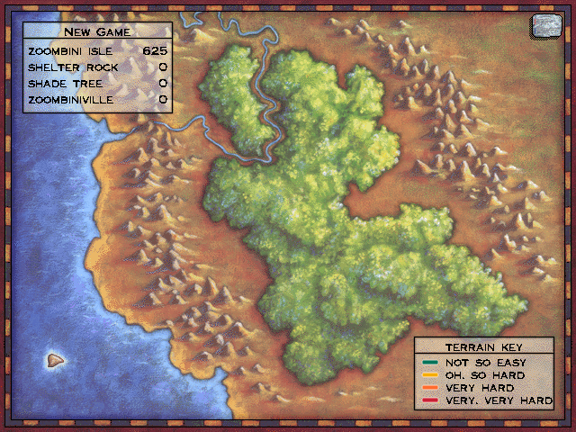
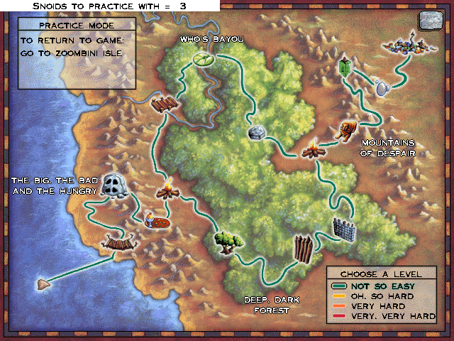

# The map and the journey

## The map (scene 1)

> 📷 **Screenshot: `map-overview`**
> *The map with its sixteen hotspots drawn on the terrain and the text box at upper left.*
> *Capture:* from Zoombini Isle click the map button (panel button 5).

> 📷 **Screenshot: `map-practice-levels`**
> *The map in practice mode: the level list (1-4) and the "snoids to practice with" count in the text box.*
> *Capture:* open the map with no saved journey so every hotspot is available.

| | |
| --- | --- |
| Scene / module / archive | 1 / `decomp/picker.cpp` / `MAP` (`Map.MHK`) |
| Input | `pickerGroups`: 17 items → `mapClicked`; hotspot 17 is "the rest of the screen" |

The map has **sixteen hotspots** (`placeNames`), each a place:

| # | Place | Goes to | | # | Place | Goes to |
| --- | --- | --- | --- | --- | --- | --- |
| 1 | Zoombini Isle | 3 | | 9 | Fleens! | 13 |
| 2 | Allergic Cliffs | 7 | | 10 | Hotel Dimensia | 14 |
| 3 | Stone Cold Caves | 8 | | 11 | Mudball Wall | 15 |
| 4 | Pizza Pass | 9 | | 12 | Shade Tree | 5 |
| 5 | Shelter Rock | 4 | | 13 | The Lion's Lair | 16 |
| 6 | Captain Cajun's Ferryboat | 10 | | 14 | Mirror Machine | 17 |
| 7 | Titanic Tattooed Toads | 11 | | 15 | Bubblewonder Abyss | 18 |
| 8 | Stone Rise | 12 | | 16 | Zoombiniville | 6 |

| Function | Address | Role |
| --- | --- | --- |
| `openMap` | `0x42fa4b` | loads the sounds, backdrop and saved areas, makes the map's views, loads sounds 998-999 |
| `mapFrame` | `0x42feaf` | per-frame |
| `pickHotspot` | `0x430030` | picks hotspot *n* and redraws the "open hotspots" view: **in the game only the isle (1) and the camps and town (5, 12, 16) are selectable, and 5, 12 and 16 only once the per-group "left" bits say they've been reached** (`gameState+0x50`, `+0x52`, `+0x51`); in practice mode every place is, subject to the same camp bits |
| `mapClicked` | `0x43010b` | the click handler: maps a hotspot to its scene (the code in the table above), plays 998, closes the map and sets `pendingScene` |
| `mapKey` | `0x43041f` | **Ctrl-P starts practice mode** (level 1); `1`-`4` then pick the level. With debugging on: `+`/`-` set the practice party size (1-16), `T` then a letter `a`-`p` previews the journey transition for that route |
| `leavePractice` | `0x430724` | returns from practice to the game |
| `drawMapBox`, `makeMapViews` | `0x430878` | the text box (`mapTexts`) and the hotspot views |

**Practice mode** (`practiceLevel`, 1-4; started with Ctrl-P) lets any place be visited at the chosen level with a practice party (`practicePartySize`, 1-16); it never changes the saved journey (`enterNextScene` skips the progress bookkeeping). Puzzles are *not* hotspots in the real game: a puzzle is reached by setting out from a camp (the camp's buttons 1 and 2, see [The camps](camps.md)). The "help" button (`helpButtonRect`) plays sound 999 and opens the help dialog. Two hotspots (8 and 9) go to *hidden* scenes instead if a cheat code was typed ([Hidden scenes](hidden.md)).

## The journey scene (scene 2)

Between most scenes the game shows the party travelling across the map, and the map's grid filling in.

> 📷 **Screenshot: `journey-travel`**
> *A map screen mid-journey: Zoombinis walking along a path, with the map's name and the grid of places visited.*
> *Capture:* leave a puzzle for the next without "transitions off" (Ctrl-T).

> 📷 **Screenshot: `journey-population-sign`**
> *The "zoombiniville population N" sign.*
> *Capture:* travel to or from Zoombiniville.

| | |
| --- | --- |
| Scene / module / archive | 2 / `decomp/xfer.cpp` / `XFER` (`xfer.MHK`) |
| Input | one whole-screen item → `journeyClicked` (a click skips ahead) |

| Function | Address | Role |
| --- | --- | --- |
| `openJourney` | `0x4697f1` | picks the map the next place is on (`xferMap`: 0 isle, 1-4 the maps, 5 the town), the backdrop, views and sounds, and fills in the grid under the map's name |
| `journeyFrame` | `0x46ace4` | after 300 ticks (and `xferSound`) goes on to `journeyTo`; now and then starts the next Zoombini walking, or an ambient view |
| `journeyClicked` | `0x46b00e` | leaves for the scene due, or on to `journeyTo` |
| `setUpGrid`, `markGridCell`, `spreadGridMarks` | `0x46b872` | the grid of visited places |
| `drawPopulationSign` | `0x46b761` | the population sign |
| `readPlaceLevels` | | which places are done at which levels |

`journeyRoute` (1-16) names the route from `journeyFrom` to `journeyTo`; `enterNextScene` sets them (`viaMap`). It's skipped when `skipJourneyMap` or `transitionsOn` is set, in practice mode, and when moving between scenes that don't leave a place.

## Things to know

- The map text strings `levelTexts` and `mapTexts` (`picker.h`, `zoombinis.h`) include "terrain key", "choose a level", the month names (used for the records) and "when traveling was".
- Because `pickHotspot` limits the real game to the isle, camps and town, the map in a normal game is a way to *return* to those; the puzzle hotspots are mainly for practice mode.
