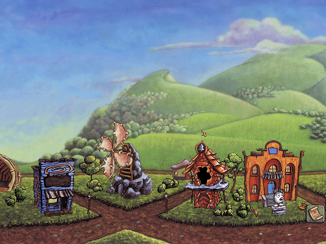
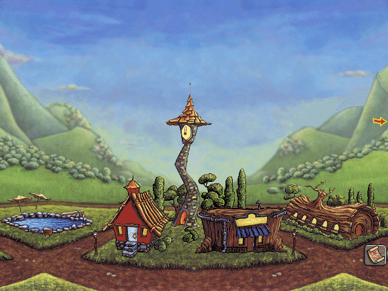

# Zoombiniville

The final destination, and the memorial of every journey.

## On screen

> 📷 **Screenshot: `town-overview`**
> *Zoombiniville: one of the six 320-pixel-wide screens of the town, with townsfolk walking and the settled Zoombinis around.*
> *Capture:* finish Bubblewonder Abyss, or open the town from the map (hotspot 16).

> 📷 **Screenshot: `town-monument`**
> *A monument's plaque open: "this monument was made to honor the zoombinis who:" and the journey it records.*
> *Capture:* click a building in the town.

> 📷 **Screenshot: `town-clock`**
> *The clock tower, with hands showing the real time; clicking it winds them.*
> *Capture:* click the clock (`townsfolkViews[0]`).

| | |
| --- | --- |
| Scene / module / archive | 6 / `decomp/town.cpp` / `TOWN` (`Town.MHK`) |
| Input | `townGroups6`: one button and the whole screen → `townClicked` |

## Entry points

| Function | Address | Role |
| --- | --- | --- |
| `openTown` | `0x45c52e` | adds the travellers to the population (`townFull` at 625) and the town's slots, builds the four town views (the highest cel shown, `highestTownCel`, depends on the population), walkers for every 37 over 20 (up to 16), the last 20 Zoombinis to settle, scrolls to the screen last shown, and picks the first sound (a hint, a greeting, or 3003 when the town is full) |
| `townFrame` | `0x45d07e` | removes townspeople who have walked off and adds more; every 150-300 ticks plays the next remark; occasionally has a settled Zoombini do something; sets the cursor by what it's over (a hotspot, the sides to scroll) |
| `townClicked` | `0x45d468` | any click closes an open plaque; button 1 leaves; in the town: winds the clock, drags a Zoombini (who stays where dropped on the ground, y 410-475), opens the plaque of the hotspot under the cursor, or scrolls at the sides |
| `scrollTown` | `0x45ce80` | moves every view with flag 2 a screen (320) left or right, wrapping around the town's 1920 pixels |
| `drawClock`, `readClock` | `0x45cd27` | the clock (re-read every 1800 ticks) |
| `settleTravellers` | `0x45dfb1` | turns the party into settled townspeople |
| `addTownsperson`, `townsfolkNotify` | `0x45e06e` | townspeople walking on and off |
| `placeRecordHotspots`, `findTownHotspot` | `0x45db25`, `0x45d715` | the buildings' hotspots, one per record |

## The records

Each building is a **monument** (`monumentBuildings[16]`, `monumentTexts[16]`: "this monument was made to honor the zoombinis who:", "this city hall celebrates…", "this clock tower was constructed for…", "this paper clip museum…", "this courthouse…") recording a journey the player completed: the 16 records in `gameState` (`recordYears`, `recordMonths`, `recordDays`, `recordGroups`, `recordLevels`) say when, which group and which level. The plaque's feat text comes from `featTexts[16]` (one per group and level, e.g. "ambled past allergic cliffs, cruised on by stone cold caves, and appeased arno the almost omnivorous"), and the date from `levelTexts` (months). The population shown ("zoombiniville population N") counts the Zoombinis that have settled.

## Things to know

- The town is **1920 pixels wide in six screens**; every scrolling view has flag 2.
- The window's cursor changes over hotspots and at the edges (`cursorFrame`, `setCursorMode`).
- The same module holds the intro scene (0), so a "town" bug may be in the logo code and vice versa.
- Greetings are sounds 3000-3002 in turn; when the town is full, 3003.
